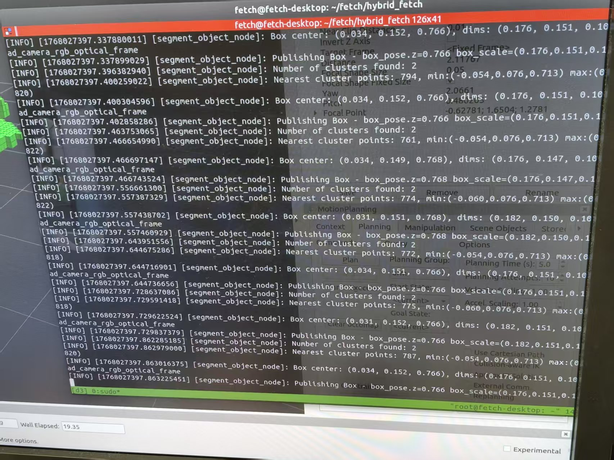

# Fetch Hybrid Delivery System
**A ROS 1 and ROS 2 Mixed Architecture for Mobile Manipulation**

> [cite_start]**Authors:** Li Yanhao, Xu Jingwei, Wang Zhiming [cite: 3]
> [cite_start]**Date:** January 11, 2026 [cite: 4]
> [cite_start]**Institution:** Department of Computer Science [cite: 1]

---

## 1. Abstract
[cite_start]As the robotics software ecosystem transitions towards ROS 2, legacy hardware platforms like the Fetch Mobile Manipulator often remain dependent on stable, older drivers (ROS 1)[cite: 6]. [cite_start]To leverage modern computer vision algorithms available in ROS 2 while maintaining reliable hardware control, this project implements a **Fetch Hybrid Delivery System**[cite: 7]. [cite_start]The system utilizes a distributed architecture where the Host machine runs ROS 1 Melodic for motion planning and navigation, while a Docker container runs ROS 2 Foxy for point-cloud perception[cite: 8]. [cite_start]A `ros1_bridge` is deployed to facilitate real-time, cross-version data communication[cite: 9]. [cite_start]Experimental results demonstrate successful object detection, 6D pose estimation, and data bridging[cite: 10].

---

## 2. System Architecture

### 2.1 Overview
[cite_start]The architecture is divided into two distinct environments sharing a network namespace[cite: 24]:

* **Host System (ROS 1 Melodic):** Acts as the somatic control center. It handles hardware drivers, the MoveIt! [cite_start]Motion Planning Framework, the MoveBase Navigation Stack, and the main logic controller (`fetch_controller.py`) [cite: 25-29].
* **Docker Container (ROS 2 Foxy):** Acts as the cognitive center. [cite_start]It handles RGB-D data processing, Point Cloud Library (PCL) segmentation algorithms, and the `ros1_bridge` for message translation [cite: 30-32].

### 2.2 Communication Pipeline
The system relies on the `ros1_bridge` dynamic bridge. [cite_start]The data flow is defined as follows [cite: 34-39]:

1.  **Sensing:** The robot's head camera publishes images to ROS 1.
2.  **Bridging (Forward):** The data from the sensor (ROS 1) is published and bridged to the perception node (ROS 2).
3.  **Processing:** The ROS 2 node inside Docker processes the data and calculates the target object's pose.
4.  **Bridging (Backward):** The calculated pose is published to `/box_pose` (ROS 2) and bridged back to `/box_pose` (ROS 1).
5.  **Actuation:** The ROS 1 controller listens to the topic, transforms the coordinates to the `base_link` frame, and executes the grasp.

---

## 3. Implementation Details

### 3.1 ROS 2 Perception Node
The perception module (`fetch_perception`) ingests raw point cloud data. [cite_start]It applies a RANSAC algorithm to identify the table plane and remove it[cite: 58]. The remaining points are clustered using Euclidean Clustering to isolate the target object. [cite_start]A bounding box is generated, and its centroid is published as a `geometry_msgs/PoseStamped` [cite: 59-60].


[cite_start]*Figure 1: ROS 2 Perception Log showing successful object detection and pose publishing[cite: 87].*

### 3.2 The Bridge Configuration
[cite_start]To ensure seamless communication, we utilized the `dynamic_bridge` with a specific parameter mapping for key topics[cite: 89].

The startup command used in the container is:

```bash
# Inside Docker Container
source /opt/ros/noetic/setup.bash
source /opt/ros/foxy/setup.bash

ros2 run ros1_bridge dynamic_bridge --bridge-all-topics \
  -m geometry_msgs/PoseStamped \
  -m visualization_msgs/Marker
